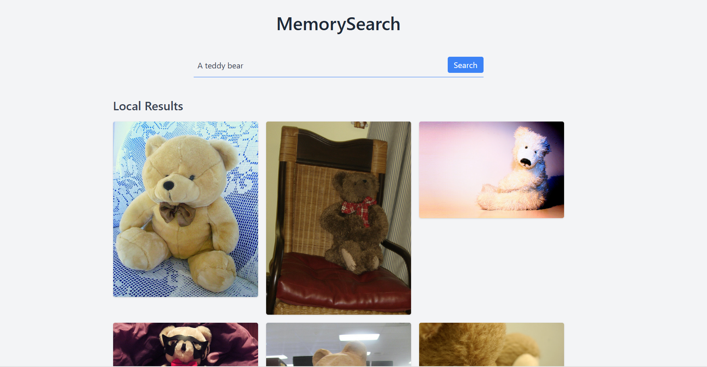

# MemorySearch

MemorySearch is a hybrid **local + agentic image search engine** that combines:

- Semantic vector search (CLIP + FAISS)
- LLM-powered query expansion
- Dynamic web ingestion

The system is built around a simple idea:

> Search shouldn’t just retrieve — it should **learn and grow over time**

---

## Core Philosophy

### Traditional search engines:
- Index the web once  
- Rely heavily on metadata, tags, and links  
- Return static results  

### MemorySearch takes a different approach:

---

## 1. Content > Metadata

Images are not searched by filenames or tags.

They are searched by **what they actually are**.

```
Image → embedding → meaning  
Text → embedding → meaning  
→ similarity matching  
```

This allows queries like:
- "cat with a hat"
- "something nostalgic"
- "dark fantasy vibe"

without needing explicit labels.

---

## 2. Search as a Thinking Process (Agentic Search)

Instead of a single query:

```
User query → search
```

MemorySearch does:

```
User query  
→ LLM expands intent  
→ multiple semantic queries  
→ multiple searches  
→ combined results  
```

---

## 3. Search That Builds Memory

```
User query  
→ search local memory  
→ fetch new images from the web  
→ download images  
→ embed images  
→ store in FAISS  
→ future queries can retrieve them  
```

---

## 4. Hybrid Retrieval (Local + Web)

Local Results:
- Fast
- Already indexed

Web Results:
- Newly discovered
- Added to memory

---

## System Architecture

```
Frontend  
↓  
Flask Backend  
↓  
Agent Layer  
↓  
FAISS + CLIP  
```

---

## Summary

MemorySearch is:

> A self-expanding semantic memory system

